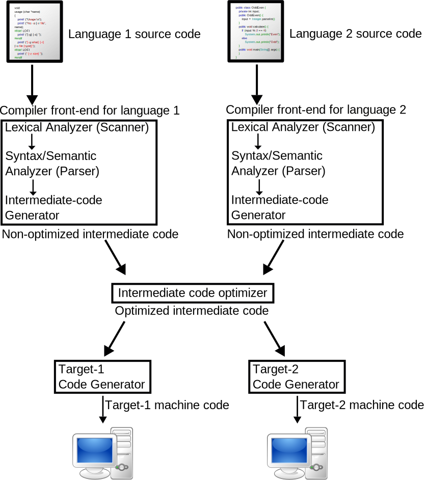
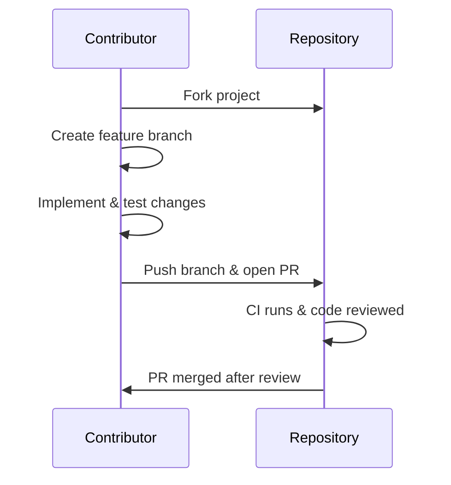

# D‑Compiler 🚀  
*A modern compiler for a C-like language, written in Rust and targeting WebAssembly.*



---

## 🚦 Project Status

| Component          | Status         | Features Implemented                         |
|--------------------|----------------|----------------------------------------------|
| **Lexer**          | ✅ Complete     | Full tokenization, Unicode 15.0, error recovery |
| **Parser**         | ✅ Complete     | Pratt parser with operator precedence        |
| **Semantic Analysis** | ✅ Complete | Type checking and symbol resolution          |
| **HIR**            | ✅ Complete     | High-level IR with typed AST                 |
| **MIR**            | ✅ Complete     | Optimized Mid-level IR for control flow      |
| **LIR**            | ✅ Complete     | Low-level IR ready for codegen               |
| **Code Generation**| ✅ Complete     | WebAssembly backend via WASM32               |
| **LSP**            | 🚧 In Progress  | Basic hover and diagnostics support          |
| **Debugger Support**| ⏳ Planned     | DWARF debug info generation                  |
| **Build System**   | ⏳ Planned      | Custom incremental build system              |
| **Community**      | ⏳ Planned      | Website, documentation, and playground       |

---

## 🏗️ Architecture Overview

```mermaid
flowchart TD
    Source[Source Code] --> Lexer
    Lexer -->|Tokens| Parser
    Parser -->|AST| Semantic
    Semantic -->|Typed AST| HIR
    HIR -->|HIR| MIR
    MIR -->|MIR| LIR
    LIR -->|LIR| CodeGen
    CodeGen --> Executable[WASM Binary]

    SymbolTable --> Parser
    SymbolTable --> Semantic
    ErrorHandler --> Lexer
    ErrorHandler --> Parser
````

---

## 📖 Language Features

* C-like syntax: `int`, `float`, `bool`, `char`, `void`
* Arithmetic, logical, and comparison operators
* Control flow: `if`, `else`, `while`, `for`, `return`
* Functions with parameters and return values
* Lexical scoping with block-level variables
* Typed expressions with compile-time type checking

---

## 📂 Project Structure

```
D-Compiler/
├── compiler/
│   ├── src/
│   │   ├── lexer/         # Tokenization logic
│   │   ├── parser/        # Pratt parser for expressions
│   │   ├── semantic/      # Type checker and symbol resolver
│   │   ├── hir/           # High-Level Intermediate Representation
│   │   ├── mir/           # Mid-Level Intermediate Representation
│   │   ├── lir/           # Low-Level Intermediate Representation
│   │   └── codegen/       # WebAssembly code generation
│   └── Cargo.toml
├── cli/
│   ├── src/
│   │   └── main.rs        # CLI entry point
│   └── Cargo.toml
├── lsp/
│   ├── src/
│   │   └── main.rs        # LSP server
│   └── Cargo.toml
├── Cargo.toml             # Workspace manifest
└── README.md
```

---

## 🚀 Building the Compiler

### 🔧 Prerequisites

* Rust 1.78 or higher (`rustup update`)
* WASM toolchain:

  ```bash
  rustup target add wasm32-unknown-unknown
  ```

### ⚙️ Build & Test

```bash
# Build optimized release version
cargo build --release

# Run the full test suite
cargo test --workspace
```

---

## 🤝 Contribution Guidelines

### 📌 Development Workflow



### ✅ Quality Standards

1. > 95% unit test coverage for new features
2. Benchmarks for performance-sensitive changes
3. Clippy-clean builds (no lints or warnings)
4. Updated documentation (README, doc-comments)
5. Follows [Semantic Versioning](https://semver.org)

---

## 🔭 Roadmap

* [ ] Full WASI system interface support
* [ ] Playground with live code preview (WASM)
* [ ] Richer type system (structs, enums, generics)
* [ ] SSA-form MIR for advanced optimizations
* [ ] Debugger integration using DWARF

---

## 📝 License

MIT © [Ammar Alnagar](https://github.com/Ammar-Alnagar)

---

**Happy Hacking!** 🧠
*— The D‑Compiler Team*

```

---
