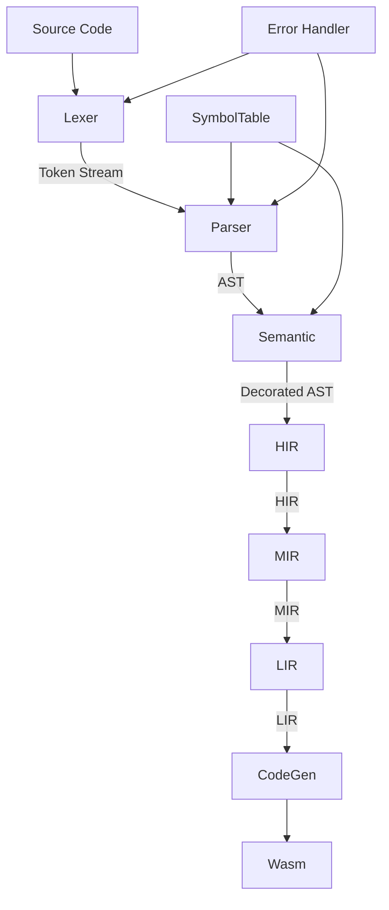
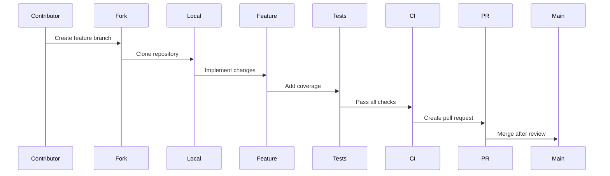

# D-Compiler 🚀


## 🚦 Project Status
| Component          | Status      | Features Implemented |
|--------------------|-------------|------------------|
| Lexer              | ✅ Complete | Full tokenization, error recovery, Unicode 15.0 |
| Parser             | ✅ Complete | Pratt parser with operator precedence |
| Semantic Analysis  | ✅ Complete | Basic type checking |
| HIR                | ✅ Complete | High-Level Intermediate Representation |
| MIR                | ✅ Complete | Mid-Level Intermediate Representation |
| LIR                | ✅ Complete | Low-Level Intermediate Representation |
| Code Generation    | ✅ Complete | WebAssembly backend |
| LSP                | 🚧 In Progress | Basic hover support |
| Debugger Support   | ⏳ Planned | DWARF debug info generation |
| Build System       | ⏳ Planned | Custom build system |
| Community          | ⏳ Planned | Website and playground |

## 🏗️ Architectural Overview


## 📂 Project Structure

```
D-Compiler/
├── compiler/
│   ├── src/
│   │   ├── lexer/
│   │   ├── parser/
│   │   ├── semantic/
│   │   ├── hir/
│   │   ├── mir/
│   │   ├── lir/
│   │   └── codegen/
│   └── Cargo.toml
├── cli/
│   ├── src/
│   │   └── main.rs
│   └── Cargo.toml
├── lsp/
│   ├── src/
│   │   └── main.rs
│   └── Cargo.toml
├── Cargo.toml
└── README.md
```

## 🚀 Building the Compiler
### Prerequisites
- Rust 1.78+

### Installation & Testing
```bash
# Build optimized version
cargo build --release

# Run test suite
cargo test --workspace
```

## 🤝 Contribution Guidelines
### Development Workflow


### Quality Standards
1. 95%+ test coverage
2. Benchmarks for performance changes
3. Documentation updates
4. Clippy lint standards
5. Semantic versioning compliance

---
**Happy Compiling!** 🔧
_The D-Compiler Team_
```
